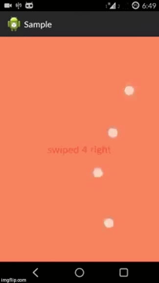
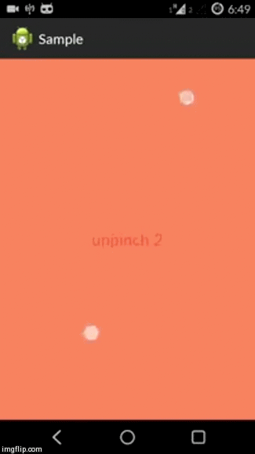
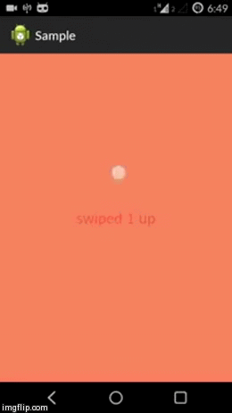

# SimpleFingerGestures 
 An android library to implement simple 1 or 2 finger gestures easily
[](https://www.codementor.io/championswimmer?utm_source=github&utm_medium=button&utm_term=championswimmer&utm_campaign=github)

[](https://travis-ci.org/championswimmer/SimpleFingerGestures_Android_Library)
[](http://android-arsenal.com/details/1/777)
[](https://jitpack.io/#championswimmer/SimpleFingerGestures_Android_Library/1.2)

##Example
    
   


## Library
 The library is inside the <a href="./libSFG">libSFG</a> folder

## Sample App
 The sample App is inside the <a href="./sample">sample</a> folder


### Implementing SimpleFingerGestures

 1. Create an object of class SimpleFingerGestures

```java
private SimpleFingerGestures mySfg = new SimpleFingerGestures();
```

 2. Implement the required gestures via this object

```java
mySfg.setOnFingerGestureListener(new SimpleFingerGestures.OnFingerGestureListener() {
            @Override
            public boolean onSwipeUp(int fingers, long gestureDuration) {
                grtv.setText("swiped " + fingers + " up");
                return false;
            }

            @Override
            public boolean onSwipeDown(int fingers, long gestureDuration) {
                grtv.setText("swiped " + fingers + " down");
                return false;
            }

            @Override
            public boolean onSwipeLeft(int fingers, long gestureDuration) {
                grtv.setText("swiped " + fingers + " left");
                return false;
            }

            @Override
            public boolean onSwipeRight(int fingers, long gestureDuration) {
                grtv.setText("swiped " + fingers + " right");
                return false;
            }

            @Override
            public boolean onPinch(int fingers, long gestureDuration) {
                grtv.setText("pinch");
                return false;
            }

            @Override
            public boolean onUnpinch(int fingers, long gestureDuration) {
                grtv.setText("unpinch");
                return false;
            }
        });
```

 3. And finally set this object onto your view's OnTouchListener

        myView.setOnTouchListener(mySfg);

    This can be set as the OnTouchListener of any object that is derived from android.view.View


### How to add to your project

The easiest way to add to your project is the download the latest zip from the Releases tab.
Inside you'll find a compiled library in .jar format that you can just drop in to the
libs folder of your Android app project for it to get automatically added as a library

Also you can add it using jitpack maven distribution.  
Add the jitpack maven repository

```groovy
    repositories {
        jcenter()
        maven {
            url "https://jitpack.io"
        }
    }
```

Add the dependency

```groovy
    dependencies {
            compile 'com.github.championswimmer:SimpleFingerGestures_Android_Library:1.2'
    }
```

### Documentation

Find documentation at  

http://championswimmer.github.io/SimpleFingerGestures_Android_Library/documentation

